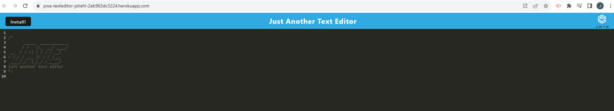

# PWA Text Editor

## Description/What I attempted to do

Build a text editor that runs in the browser and meets PWA criteria and also works offline.

## Table of Contents

### [Usage](#usage)

### [License](#license)

### [Contributing](#contributing)

### [Questions](#questions)

## Usage

Run `npm run start` from the root directory and the application will start up the backend and serve the client.

## License

The license for this project is MIT and the link for license information is https://opensource.org/licenses/MIT.

## Contributing/Acknowledgements

Tips from University of Minnesota Full Stack Bootcamp instructor Gary Almes and notes from class sessions. Our instructor gave us notes/code to help with this assignment.

Tips from class TA Katy Vincent.

## Questions

Please find more information at my GitHub, located [here](https://github.com/Jacqueline-Stiehl).
If you have additional questions, please contact me at salsajackie@yahoo.com.

## Screen shot

## Link to the working version of the code

https://github.com/Jacqueline-Stiehl/pwa-texteditor-jstiehl

## URL of deployed application

https://jacqueline-stiehl.github.io/pwa-texteditor-jstiehl/

## Heroku

Heroku app name: pwa-texteditor-jstiehl:

https://pwa-texteditor-jstiehl-2eb963dc3224.herokuapp.com/
